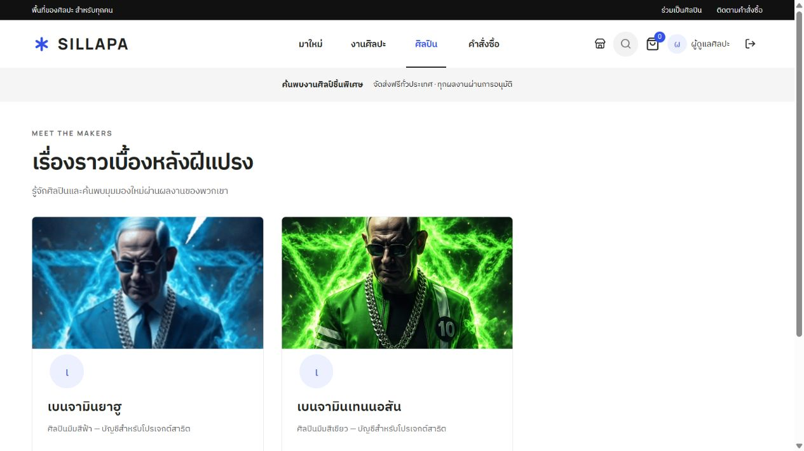
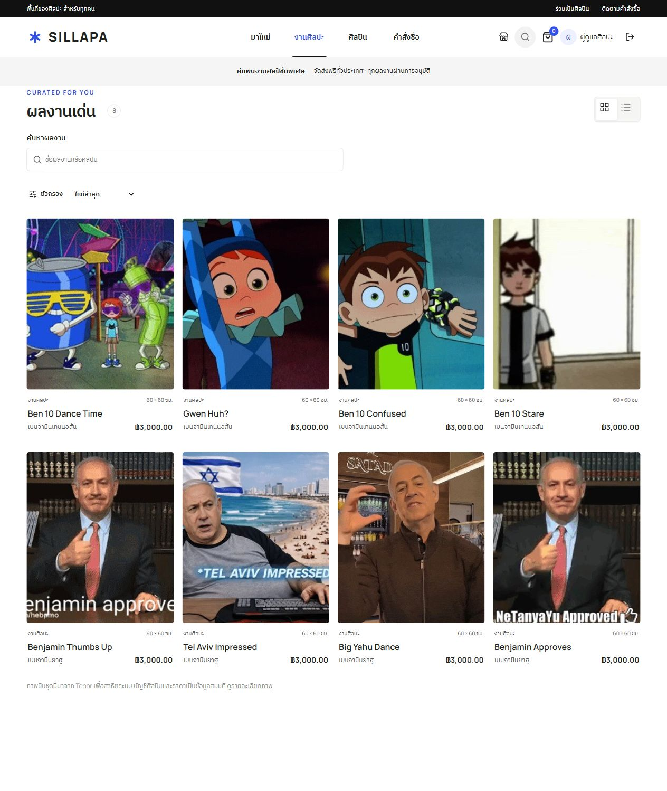

# Integration test results

Executed: 2026-10-03T10:35:51.011Z

Production Next.js server with isolated local test data. No live payment sent.

- PASS: Vercel page shell, guest session, geography and payment options render without database startup; no unverified user is exposed
- PASS: Helpful HTTP 404 and bounded, validated same-origin performance/error reporting
- PASS: Persistent 30-day session cookie restores the same account in a new client
- PASS: Registration ignores injected role; new users are customers
- PASS: Server-side role checks protect users, reports and audit logs
- PASS: Cross-origin writes rejected
- PASS: Invalid login and registration validation
- PASS: Two artists own four internet memes each; one art category and backward-compatible links
- PASS: Missing art returns 404; artists cannot edit another artist’s work
- PASS: Uploads validate actual image bytes, size/type and uploader role; drafts stay private
- PASS: Homepage poster: admin upload/save/reset, public published image, role protection and audit log
- PASS: Artwork/category CRUD, validation, review and draft-to-public transitions
- PASS: Search, category/price filters, price sort and non-overlapping pagination
- PASS: Saved addresses: Thai geography validation, ownership, one default, deletion fallback and immutable order snapshot
- PASS: Checkout stores bank payment and buyer note; server controls shipping/total and rejects unsupported payment
- PASS: Checkout computes price on server; idempotency, reservation and private orders enforced
- PASS: Private slips, rejection/re-upload, admin-only payment confirmation and shipping workflow
- PASS: Concurrent purchases have exactly one winner; cancellation releases inventory
- PASS: Dashboard totals and transactional audit trail match completed operations
- PASS: Artist portraits appear on artist listings, artist details and artwork attribution; uploaded profile ownership stays enforced
- PASS: Profile requests, role promotion, session invalidation, deactivation and self-lockout prevention
- PASS: Artwork soft deletion and unused category deletion
- PASS: Logout invalidates server-side session

23 groups passed. Live Vercel Blob connectivity is not covered without the project store token.

## Live catalogue verification

Verified separately on localhost:3102 and https://sillapa.vercel.app after deployment: two active artists, eight approved internet meme artworks, four artworks per artist. The original blue and green avatar URLs remained unchanged. The portraits appear on artist listings and details; the homepage poster and artwork gallery use meme images from Tenor. Source posts and uploader names are recorded in public/art/attributions.json. Artworks use still GIF frames for lightweight previews.

