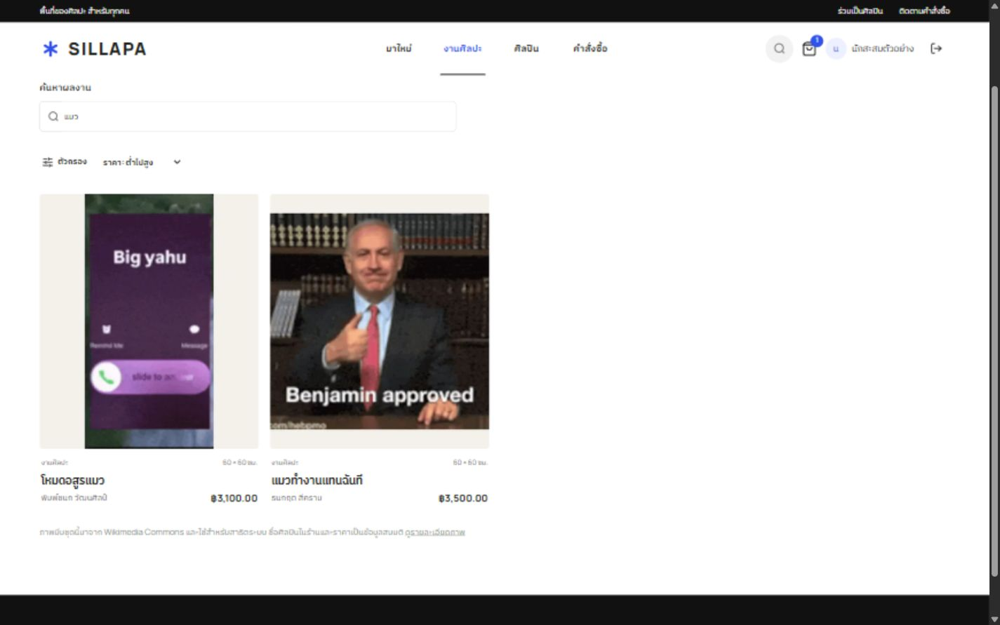
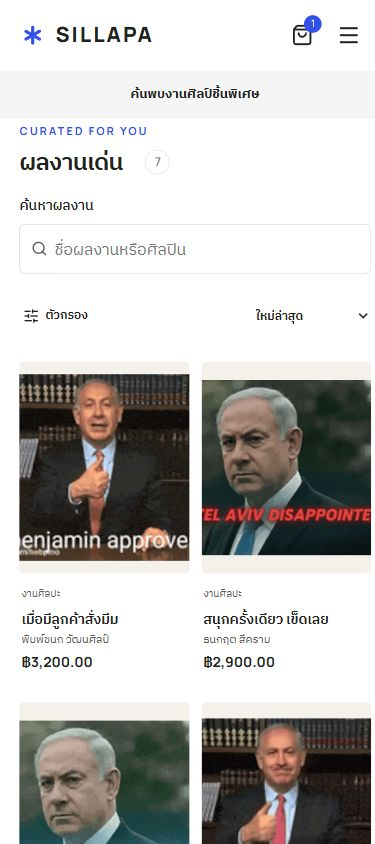

# SILLAPA UX and performance audit — 2026-10-03

Scope: existing customer, artist and admin application. Production build tested locally; no live money transferred. This is an implementation and test record, not a claim that every device or production deployment is defect-free.

## Checklist

| Requirement | Implementation / existing protection verified |
| --- | --- |
| Fast loading | Responsive hashed WebP variants for sample gallery images, local WOFF2 fonts with included licenses, immutable asset caching, public-list request deduplication, short fresh cache and background revalidation, deferred account/workspace bundles. |
| Responsive | Existing mobile navigation and workspace layouts retained; narrow controls, readable 16px form inputs and wrapping added. Gallery/profile, artist forms and admin pages checked at narrow widths; admin/gallery checked down to 320px, and admin poster checked at 390/768/1440px viewports. Scrollable tables stay inside their containers. |
| Navigation | Shared centered desktop navigation; homepage poster stays on homepage. Browse/home links on empty, error and 404 pages. |
| Consistent UI | Shared buttons, skeletons, inline errors, focus outlines and disabled states. |
| Feedback | Immediate pressed feedback, delayed thin navigation progress, busy labels, disabled submit, polite live success toast, red inline errors. |
| Forms | Labels and existing server validation retained; Zod errors use Thai locale. Address defaults and dependent geography fields protected by integration tests. |
| Smooth motion | Short transitions; skeleton pulse respects reduced-motion settings. No artificial page delays added. |
| Layout stability | Reserved image aspect ratios, stable navigation, viewport-sized main content, gallery results minimum height and skeletons matching the visible card row. Checkout never reports an unloaded total as zero. |
| Accessibility basics | Skip link, visible keyboard focus, image alt text, labelled controls, live errors/status and native modal focus containment. Not a formal WCAG certification. |
| CTAs | Gallery search always visible; checkout, upload and account actions retain explicit text and disabled states. |
| Search | Debounced search plus URL-backed category, artist, price, status, sort, page and view. |
| Persistent state | Cart in localStorage; 30-day server session; gallery state in URL; user-scoped tab drafts for non-password login/registration fields, profile fields and checkout note/address/method and user-scoped management/order filters. Storage exceptions are guarded. |
| Empty/error states | Helpful empty cart/no results/auth prompts, defensive parsing of non-JSON API errors and retry actions. |
| Skeletons | Gallery, compact checkout and generic row placeholders; no visible generic “กำลังโหลดข้อมูล…” spinner. Private data is not retained in the public preview cache. |
| Back/forward | URL is the gallery filter source of truth; verified filtered/sorted results restored on back and hard reload. |
| Destructive actions | Existing deletion/cancellation confirmations retained; poster reset confirmation added. Unsaved modal edits now use an inline keep/discard confirmation. |
| Notifications | Shared success toast uses polite aria-live; form errors stay near the form instead of popup alerts. |
| 404/fallback | Unknown routes return HTTP 404; route/global error pages offer retry/home. |
| Security basics | Existing password hashing, HttpOnly persistent session, production Secure cookie, role checks, same-origin writes, upload validation and server-controlled totals exercised in integration tests. Demo credentials remain intended for school demonstration. No password reset service added. |
| Monitoring | Bounded same-origin LCP/CLS/navigation and slow API/runtime error reports to runtime logs; route IDs/query values and form contents omitted. No external error-tracking account required. |

## Journey evidence

1. Homepage / shared navigation — inspected desktop baseline. **Improved:** shared layout retained, local assets and initial server session reduce extra loading.
2. Browse → search → sort — **Verified:** query “แมว” produced two results and ascending price order; responsive WebP currentSrc loaded.
3. Detail → back → refresh → forward — **Verified:** search/sort survived back and hard reload, forward returned to artwork detail.
4. Cart / checkout — **Verified:** item and note survived navigation; unloaded totals show a dash and confirmation stays disabled. Test note was cleared; no order placed through the browser.
5. Customer profile — **Inspected:** labelled customization fields and no horizontal overflow at 375px. Profile draft survived hard reload; avatar and cover upload controls have distinct labels; invalid submission showed red inline feedback. Test drafts were restored/cleared without saving profile changes.
6. Artist/admin management — **Integration verified:** access control, artwork review, orders/payment/shipping, poster editing, users, reports and audit trails. Browser sweep covered artist dashboard/artworks/orders, upload dialog and all admin sections; review dialog inspected without publishing the pending sample.
7. Failure/recovery — **Integration verified:** unknown route is actual 404, metrics validation/origin checks, invalid auth, upload and purchase errors. Empty login/registration fields showed red inline messages without native validation popups. Keyboard focus reached the hidden upload input with a visible label outline. Browser search-empty recovery, admin user-search clearing, public profile links and 404 home recovery were exercised. Admin order status survived hard reload. Checkout payment choice survived leaving the page and returning. The unsaved modal warning was changed to inline controls and retested: keep preserves the entered name; Escape exposes the warning; discard closes and restores focus to the opener.

## Verification and remaining scope

`npm run build` includes TypeScript validation. `npm run test:integration`: 21 groups passed with an isolated local database. See [TEST-RESULTS.md](TEST-RESULTS.md).

The original browser tab became blocked by a native confirmation. Testing recovered in a fresh visible in-app browser tab. The new inline discard control, login/logout and role-specific pages were then tested. Browser screenshots and sampled DOM checks supplement the API integration suite; they do not replace a formal automated accessibility or real-device audit.

The browser console in the fresh test tab reported no errors/warnings during the checked journeys.

A final local artist-detail trace after reserving page height reported CLS 0.0014; gallery trace reported CLS 0. These are individual local observations, not field performance scores.

No promise of zero latency or zero layout shift is made. Vercel cold starts, Blob connectivity, deployment status and field performance need verification against the live deployment; local test results do not cover them. Google login still depends on the existing Google OAuth environment configuration.

## Screenshots

Desktop gallery after search/sort:

Mobile gallery after shared UI and asset changes:

